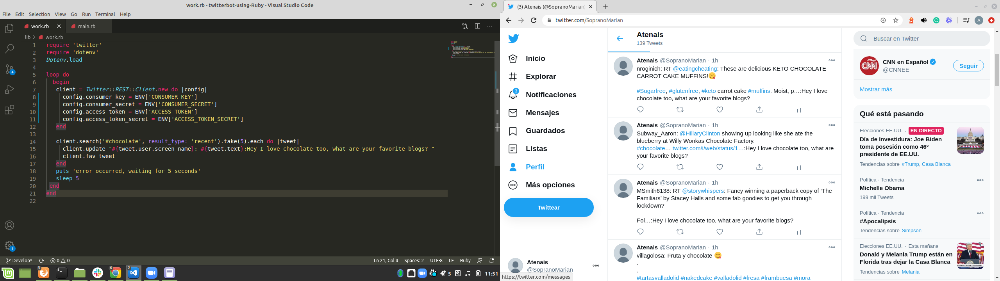

# twitterbot-using-Ruby

> This is a solo project with Ruby for building a bot.

- A bot developed in Ruby
- Used Twitter’s APIs
- Sent application for a Twitter developer account

# Instructios on how the twitter bot works

- After hiding the consumer_key, consumer_secret,    access_token and access_token_secret using .env gem I started with  code.
- I used CLient object to access to the twitter API's 
With client.search we are looking for specific word and taking the 5 most recent twitts and posting them adding ":Hey I love chocolate too, what are your favorite blogs?"
and to others giving a like

- All this is happens by runing ruby bin/main.rb in terminal 

## Built With

-Ruby

## Install
- Download Ruby from https://www.ruby-lang.org/en/ to run it locally .

## Clone
- Clone the repository from https://github.com/atenaiis/twitterbot-using-Ruby.git

## Run
-Run code with  `ruby bin/main.rb`in your local terminal

## Authors

👤 **Author1**

- Github: [@atenaiis](https://github.com/atenaiis)
- Twitter: [@spranomarian](https://twitter.com/SopranoMarian)
- Linkedin: [linkedin](https://www.linkedin.com/in/mariana-atenai-campos-garcia-a30791143/)

## 🤝 Contributing

Contributions, issues and feature requests are welcome!

## Show your support

Give a ⭐️ if you like this project!

## Acknowledgments

- Hat tip to anyone whose code was used
- Inspiration
- etc

