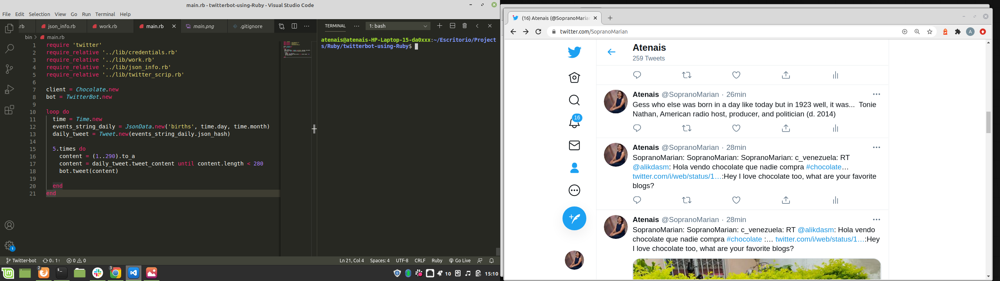

# twitterbot-using-Ruby

> This is a solo project with Ruby for building a bot.
- The aim of this project was to build a Twitter bot developed in Ruby
- Using two API's, to comment a tweet and to share a twit with #chocolate and to share a birth event on the current date but from a different year

# Instructios on how the Twitter bot works
If you want to have a version in your local work area:
- Need to create a developer account for Twitter. I leave the page for you to do it. [Twitter for Developers](https://github.com/atenaiis)
- You will get 4 different keys, after hiding the consumer_key, consumer_secret, access_token, and access_token_secret,  clone this repository on your local machine,from https://github.com/atenaiis/twitterbot-using-Ruby.git
- Rename the template.env. Its name should be just ".env"
- Replace the content of the .env using the keys provided by Twitter.
- Run the command below on your root folder to install the necessary dependencies of the project

bundle install

- Run bin/main.rb in your terminal

- All this is happens by runing ruby bin/main.rb in terminal 

## Built With

-Ruby
- json
## Install
- Download Ruby from https://www.ruby-lang.org/en/ to run it locally .

## Clone
- Clone the repository from https://github.com/atenaiis/twitterbot-using-Ruby.git

## Run
-Run code with  `ruby bin/main.rb`in your local terminal

## Authors

👤 **Author1**

- Github: [@atenaiis](https://github.com/atenaiis)
- Twitter: [@spranomarian](https://twitter.com/SopranoMarian)
- Linkedin: [linkedin](https://www.linkedin.com/in/mariana-atenai-campos-garcia-a30791143/)

## 🤝 Contributing

Contributions, issues and feature requests are welcome!

## Show your support

Give a ⭐️ if you like this project!

## Acknowledgments

- Hat tip to anyone whose code was used
- Inspiration
- etc

## 📝 License

This project is [GNU](https://www.gnu.org/licenses/) licensed.
